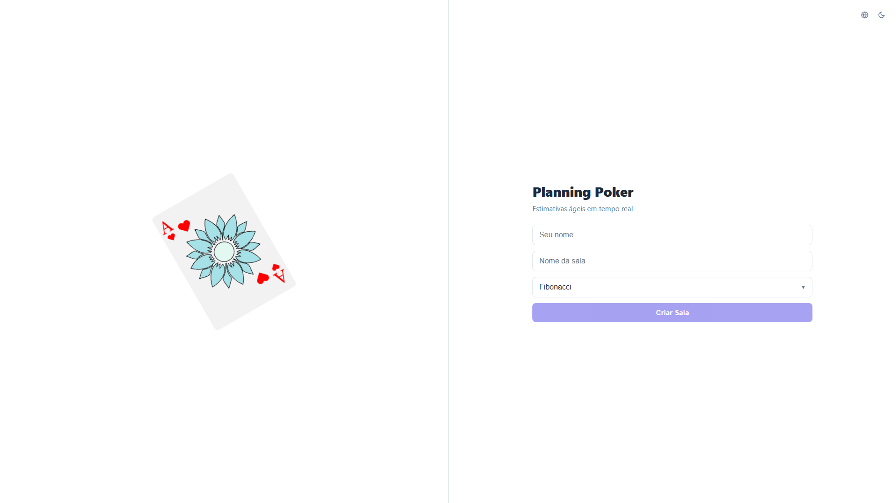
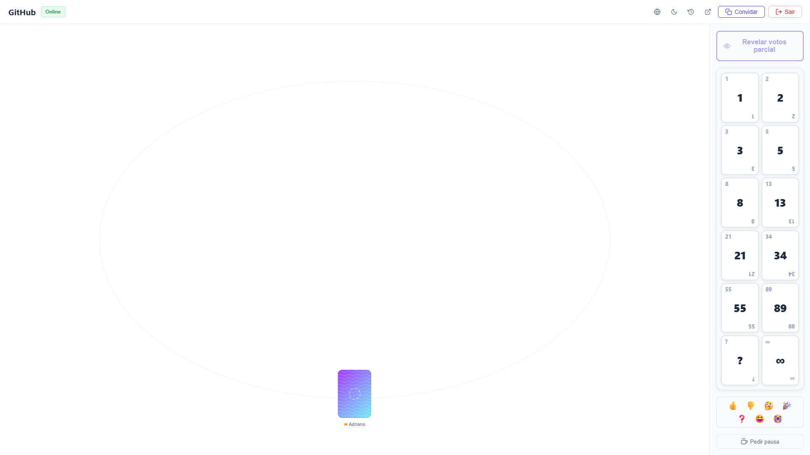
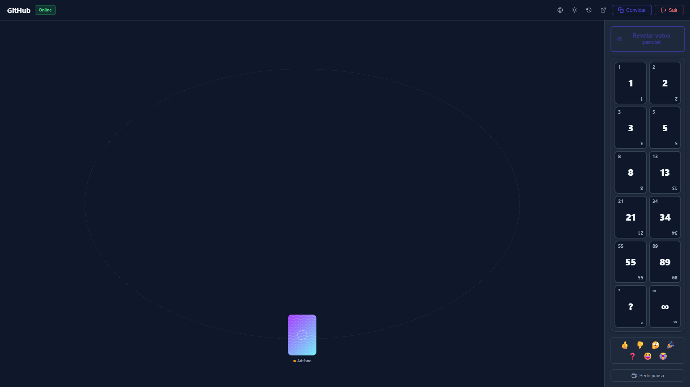
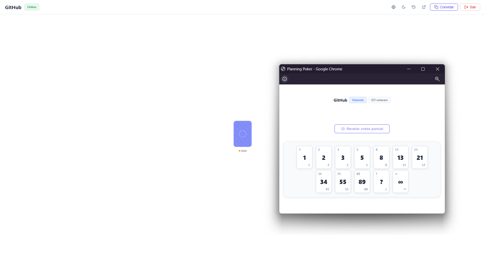

<h1 align="center">Planning Poker</h1>

<p align="center">
  Real-time Planning Poker for agile teams — React 19, .NET 9, SignalR, Docker
</p>

<p align="center">
  
  
  
  
</p>

---

## Overview

<!-- TODO: Replace with actual screenshots -->

| Home | Room | Dark Mode | Mini View |
|------|------|-----------|-----------|
|  |  |  |  |

## About

Planning Poker is a real-time estimation tool for agile teams. Create a room, invite your team via link, vote on story points, and reveal the results together. Built with SignalR WebSockets for instant synchronization.

## Built with

- [React 19](https://react.dev/) with TypeScript and Vite
- [.NET 9](https://dotnet.microsoft.com/) with SignalR
- [react-colorful](https://github.com/omgovich/react-colorful) for the color picker
- [xUnit](https://xunit.net/) for unit testing
- [Docker](https://www.docker.com/) for containerization

## Features

- Real-time voting with SignalR WebSocket
- 6 estimation decks (Fibonacci, T-Shirt, Sequential, Linear, Powers of Two, Half-Point)
- Vote summary with approximate and exact mean
- Round history with per-round statistics
- Kick player and transfer ownership
- Anonymous coffee break counter with clear-all for the room owner
- Anonymous emoji reactions with floating animation
- Customizable card style per player (color, gradient, pattern) persisted in localStorage
- Celebration animation when all votes match
- Mini-view popup for multi-monitor setups
- Dark/Light mode
- i18n: Portuguese, English, Spanish
- Automatic reconnection with 20s grace period
- Thread-safe room state with ReaderWriterLockSlim

## Architecture

```
┌──────────────┐       WebSocket (SignalR)        ┌──────────────────┐
│              │  <────────────────────────────>  │                  │
│   Frontend   │         STATE_SYNC               │     Backend      │
│  React 19    │         KICKED                   │    .NET 9        │
│  TypeScript  │                                  │    SignalR Hub   │
│  Vite        │                                  │    Clean Arch    │
│              │                                  │                  │
└──────────────┘                                  └──────────────────┘
```

**Backend (Clean Architecture):**

```
PlanningPoker.Api            -> SignalR Hub, Program.cs
PlanningPoker.Application    -> Services, Interfaces, Results
PlanningPoker.Domain         -> Entities, Enums, Snapshots, ValueObjects
PlanningPoker.Infrastructure -> InMemoryRoomRepository
PlanningPoker.Tests          -> xUnit (44 tests)
```

**Frontend:**

```
src/
├── components/   -> UI (Room, PlayerGrid, VotingDeck, Fireworks, etc.)
├── contexts/     -> Connection, Room, Theme, I18n, Toast
├── hooks/        -> useRoomActions, useLocalStorage, useBroadcastChannel
├── pages/        -> Home, MiniView
├── i18n/         -> Locales (pt-BR, en, es)
└── services/     -> SignalR connection
```

**State Machine:**

```
WAITING ──> VOTING ──> REVEALED
               ^           |
               └───────────┘
              (reset)
```

## Installing and Running

### Prerequisites

- [.NET 9 SDK](https://dotnet.microsoft.com/download/dotnet/9.0)
- [Node.js 22+](https://nodejs.org/)

### Local

1. Clone this repository `git clone https://github.com/AdrianoReusSavi/planningpoker.git`
2. Enter the project folder: `cd planningpoker`

**Backend:**

```bash
cd backend
dotnet run --project PlanningPoker.Api
```

**Frontend:**

```bash
cd frontend
cp .env.example .env
npm install
npm run dev
```

3. Open http://localhost:5173

### Docker

```bash
docker-compose up --build
```

- Frontend: http://localhost:3000
- Backend: http://localhost:5000

### Tests

```bash
cd backend
dotnet test
```

## Contribute

1. Fork this repository
2. Create a branch with your feature: `git checkout -b my-feature`
3. Commit your changes: `git commit -m 'feat: My new feature'`
4. Push your branch: `git push origin my-feature`

## License

This project is under the MIT license. Take a look at the [LICENSE](LICENSE) file for more details.